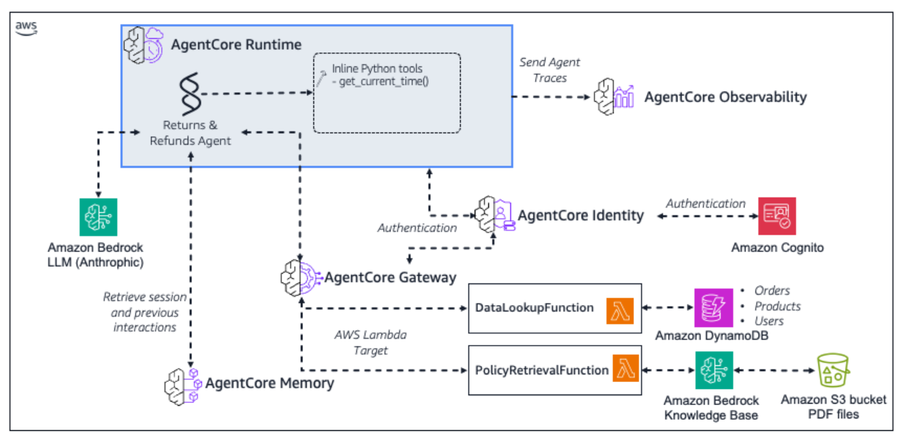

# 🔄 Returns & Refunds Agent — AWS Bedrock AgentCore

An AI-powered **Returns & Refunds Assistant** built with the [Strands Agents SDK](https://strandsagents.com/) and deployed on **AWS Bedrock AgentCore**. The agent helps administrators manage customer returns, check refund eligibility, and answer policy questions using real-time data from DynamoDB and a Bedrock Knowledge Base.

---

## What Are We Building?



---

## 📐 Architecture Overview

```
┌─────────────────────────────────────────────────────────────────────────┐
│                         Streamlit Chat UI                                │
│                    (Cognito Auth + AgentCore Invoke)                     │
└────────────────────────────────┬────────────────────────────────────────┘
                                 │ invoke_agent_runtime()
                                 ▼
┌─────────────────────────────────────────────────────────────────────────┐
│                    AWS Bedrock AgentCore Runtime                         │
│              ┌─────────────────────────────────────────┐                │
│              │   CustomerAssistantAgent (Strands SDK)   │                │
│              │   • Claude Sonnet 4.5 (Bedrock)         │                │
│              │   • AgentCore Memory (session mgmt)     │                │
│              │   • MCP Client → Gateway                │                │
│              └──────────────────┬──────────────────────┘                │
└─────────────────────────────────┼───────────────────────────────────────┘
                                  │ MCP (JSON-RPC over HTTP)
                                  ▼
┌─────────────────────────────────────────────────────────────────────────┐
│                    AgentCore MCP Gateway                                 │
│           (OAuth2 via Cognito + Semantic Tool Routing)                   │
│                                                                         │
│   ┌──────────────────────┐       ┌──────────────────────────┐          │
│   │  data-lookup target  │       │  policy-retrieval target  │          │
│   └──────────┬───────────┘       └────────────┬─────────────┘          │
└──────────────┼────────────────────────────────┼─────────────────────────┘
               │                                │
               ▼                                ▼
┌──────────────────────────┐    ┌────────────────────────────────┐
│   Lambda: data-lookup    │    │   Lambda: policy-retrieval     │
│   • order_lookup         │    │   • Bedrock Knowledge Base     │
│   • user_lookup          │    │   • RAG with country filter    │
│   • product_lookup       │    └────────────────────────────────┘
│   • find_returned        │
│   • process_refund       │
└──────────┬───────────────┘
           │
           ▼
┌──────────────────────────┐
│      Amazon DynamoDB     │
│  • workshop-orders       │
│  • workshop-customers    │
│  • workshop-products     │
└──────────────────────────┘
```

---

## 🧰 Tech Stack

| Layer | Technology |
|-------|-----------|
| Language | Python 3.12+ |
| Agent Framework | [Strands Agents SDK](https://strandsagents.com/) |
| LLM | Claude Sonnet 4.5 (Amazon Bedrock) |
| Deployment | AWS Bedrock AgentCore CLI |
| MCP Protocol | JSON-RPC over Streamable HTTP |
| UI | Streamlit |
| Auth | Amazon Cognito (User Pool + OAuth2 M2M) |
| Data Store | Amazon DynamoDB |
| Knowledge Base | Amazon Bedrock Knowledge Base (RAG) |
| IaC | AWS CDK (@aws/agentcore-cdk) |
| Observability | AWS OpenTelemetry |

---

## 📁 Project Structure

```
ReturnsRefundsAgentProject/
│
├── AgentCoreProject/                  # Primary AgentCore project (deployed)
│   ├── AGENTS.md                      # AgentCore schema & CLI reference
│   ├── agentcore/
│   │   ├── agentcore.json             # Declarative config: runtimes, gateways, memory, credentials
│   │   ├── aws-targets.json           # Deployment target (account + region)
│   │   └── cdk/                       # Auto-generated CDK stack (do not edit manually)
│   ├── app/
│   │   ├── CustomerAssistantAgent/    # ⭐ Main production agent
│   │   │   ├── main.py               # Agent entrypoint — creates agent, handles invocations
│   │   │   ├── model/
│   │   │   │   └── load.py           # Bedrock model loader (Claude Sonnet 4.5)
│   │   │   ├── mcp_client/
│   │   │   │   └── client.py         # MCP client with OAuth token management
│   │   │   └── pyproject.toml        # Python dependencies
│   │   ├── CustAssistantHarness/     # Harness variant using AgentCore Identity
│   │   │   ├── main.py
│   │   │   ├── model/
│   │   │   ├── mcp_client/
│   │   │   └── memory/
│   │   └── AgentCoreProject/         # Base/default runtime (simple assistant)
│   │       ├── main.py
│   │       └── mcp_client/
│   └── tool_specs/                    # MCP tool JSON schemas for the gateway
│       ├── data_lookup.json           # 5 tools: order/user/product lookup, find returned, process refund
│       └── policy_retrieval.json      # 1 tool: RAG policy retrieval with country filter
│
├── ReturnsRefundsAgent/               # Earlier iteration (reference/backup)
│   ├── agentcore/
│   │   └── agentcore.json
│   └── app/
│       ├── CustomerAssistantAgent/
│       └── ReturnsRefundsAgent/
│
├── lambda_functions/                  # AWS Lambda backends for MCP Gateway targets
│   ├── data_lookup/
│   │   └── handler.py                # DynamoDB queries: orders, customers, products, refunds
│   └── policy_retrieval/
│       └── handler.py                # Bedrock Knowledge Base RAG retrieval
│
├── streamlit-ui/                      # Chat UI frontend
│   ├── streamlit_app.py              # Main app: Cognito auth + AgentCore Runtime invocation
│   ├── pages/
│   │   └── 1_🏗️_Tech_Stack.py       # Architecture & achievements dashboard page
│   └── requirements.txt              # Streamlit + boto3
│
├── deploy_lambdas.py                  # Script to zip & deploy Lambda functions to AWS
├── setup_cognito.py                   # Script to create Cognito User Pool + OAuth client
├── test_gateway.py                    # Script to test MCP gateway connectivity (tools/list)
├── .gitignore
└── README.md                          # ← You are here
```

---

## 📄 File-by-File Explanation

### Agent Core (`AgentCoreProject/app/CustomerAssistantAgent/`)

| File | Purpose |
|------|---------|
| `main.py` | Agent entrypoint. Creates a Strands `Agent` with system prompt, MCP tools, and AgentCore Memory. Exposes an async `invoke()` entrypoint for the AgentCore Runtime. Streams responses back to the caller. |
| `model/load.py` | Loads the Bedrock model (`Claude Sonnet 4.5`) using `strands.models.bedrock.BedrockModel`. |
| `mcp_client/client.py` | Builds an MCP client that connects to the AgentCore Gateway. Handles OAuth2 `client_credentials` token acquisition from Cognito, caches tokens, and auto-refreshes 60s before expiry. |
| `pyproject.toml` | Declares Python dependencies: `strands-agents`, `bedrock-agentcore`, `mcp`, `boto3`, etc. |

### Lambda Functions (`lambda_functions/`)

| File | Purpose |
|------|---------|
| `data_lookup/handler.py` | Single Lambda serving 5 tools via routing on `bedrockAgentCoreToolName`. Queries DynamoDB tables (`workshop-orders`, `workshop-customers`, `workshop-products`) for order lookups, customer info, product details, returned items, and refund processing. |
| `policy_retrieval/handler.py` | Lambda that retrieves return/refund policies from a Bedrock Knowledge Base using the `retrieve` API. Supports country-based metadata filtering. Caches the KB ID from SSM Parameter Store. |

### Streamlit UI (`streamlit-ui/`)

| File | Purpose |
|------|---------|
| `streamlit_app.py` | Full chat interface. Authenticates users via Cognito `USER_PASSWORD_AUTH`, handles `NEW_PASSWORD_REQUIRED` challenges, invokes the deployed AgentCore Runtime agent, and renders streaming responses in a chat UI. |
| `pages/1_🏗️_Tech_Stack.py` | Dashboard page showing the full architecture diagram, AWS services used, agent tools, features, and project stats. |

### Infrastructure Scripts (root)

| File | Purpose |
|------|---------|
| `deploy_lambdas.py` | Reads the Lambda execution role from SSM, zips each handler, and creates/updates the Lambda functions in `us-west-2`. |
| `setup_cognito.py` | Creates a Cognito User Pool with a custom domain, resource server (`gateway/invoke` scope), and an app client for `client_credentials` OAuth flow. Saves config to `cognito_config.json`. |
| `test_gateway.py` | End-to-end test: obtains a JWT from Cognito, then calls the MCP gateway's `tools/list` method to verify connectivity and list available tools. |

### AgentCore Configuration (`AgentCoreProject/agentcore/`)

| File | Purpose |
|------|---------|
| `agentcore.json` | Declarative project config defining 3 runtimes, 1 memory resource, 1 OAuth credential, and 1 MCP gateway with 2 Lambda targets. This is the source of truth for `agentcore deploy`. |
| `aws-targets.json` | Specifies the AWS account and region (`us-west-2`) for deployment. |
| `tool_specs/data_lookup.json` | JSON schema for the 5 data lookup tools exposed through the gateway. |
| `tool_specs/policy_retrieval.json` | JSON schema for the policy retrieval tool. |

---

## 🔄 Complete Request Flow

1. **User** types a message in the Streamlit chat UI
2. **Streamlit** authenticates via Cognito (`USER_PASSWORD_AUTH`) and calls `invoke_agent_runtime()` with the prompt + session ID
3. **AgentCore Runtime** routes the request to the `CustomerAssistantAgent` runtime
4. **Strands Agent** (Claude Sonnet 4.5) processes the prompt using its system prompt and registered tools
5. **Agent** decides which tools to call based on user intent (e.g., "show orders for C-01")
6. **MCP Client** obtains an OAuth token from Cognito (`client_credentials` grant) and sends JSON-RPC tool calls to the **AgentCore Gateway**
7. **Gateway** uses semantic routing to dispatch tool calls to the correct **Lambda function** target
8. **Lambda** executes the query:
   - `data-lookup` → queries DynamoDB (orders, customers, products)
   - `policy-retrieval` → calls Bedrock Knowledge Base retrieve API
9. **Results** flow back through MCP protocol to the agent
10. **Agent** synthesizes a natural language response and streams it back to the UI
11. **AgentCore Memory** persists the conversation turn for session continuity

---

## 🎯 Understanding the `@tool` Decorator

The Strands `@tool` decorator is how you give agents capabilities beyond conversation. It's the core pattern used throughout this project.

### What It Does

| Aspect | How It Works |
|--------|-------------|
| **Turns a function into a tool** | The agent can decide to call the function during a conversation when it's relevant to the user's question |
| **Uses the docstring as the tool description** | The agent reads the docstring to understand *when* to use the tool. Write clear, descriptive docstrings |
| **Uses type hints for parameters** | The agent uses the function signature to know what arguments to pass. Always include type hints |
| **Returns a string** | The tool's return value is passed back to the agent as context for generating its response |

### Example

```python
from strands import tool

@tool
def order_lookup(customer_id: str) -> str:
    """Look up all orders for a given customer.
    
    Returns order details including product IDs, purchase dates, and order status.
    Use this when the user asks about a customer's orders or purchase history.
    """
    # Query DynamoDB for the customer's orders
    response = orders_table.query(
        KeyConditionExpression=Key("customer_id").eq(customer_id)
    )
    return json.dumps({"orders": response.get("Items", [])})
```

### Why This Pattern Works

- **Simple** — Tools are just regular Python functions with a decorator
- **Testable** — Call them directly in unit tests without the agent
- **Self-documenting** — The docstring IS the tool's instruction manual for the agent
- **Type-safe** — Type hints ensure the agent passes correct argument types

> **In this project**, the Lambda functions serve as remote tool backends accessed via the MCP Gateway. The `@tool` pattern applies the same way — whether tools run locally or behind a gateway, the agent interacts with them through the same interface.

---

## 🔧 Agent Tools

### Data Lookup (via `workshop-data-lookup` Lambda)

| Tool | Input | Description |
|------|-------|-------------|
| `order_lookup` | `customer_id` | Query all orders for a customer |
| `user_lookup` | `customer_id` | Get customer name & country |
| `product_lookup` | `product_id` | Get product name, category & provider |
| `find_returned_products` | _(none)_ | Find all RETURNED orders, enriched with product names |
| `process_refund` | `customer_id`, `product_id` | Process refund for a specific order |

### Policy Retrieval (via `workshop-policy-retrieval` Lambda)

| Tool | Input | Description |
|------|-------|-------------|
| `policy_retrieval` | `query`, `country` (optional) | RAG retrieval from Bedrock Knowledge Base with country filtering |

---

## 🗄️ Data Model (DynamoDB)

| Table | Partition Key | Sort Key | Fields |
|-------|--------------|----------|--------|
| `workshop-orders` | `customer_id` | `product_id` | `purchased_date`, `status` (DELIVERED/SHIPPED/RETURNED/REFUNDED) |
| `workshop-customers` | `customer_id` | — | `name`, `country_code` |
| `workshop-products` | `product_id` | — | `product_name`, `product_category`, `provider` |

---

## 🚀 Getting Started

### Prerequisites

- Python 3.12+
- AWS CLI configured with credentials for `us-west-2`
- [AgentCore CLI](https://docs.aws.amazon.com/bedrock/latest/userguide/agentcore.html) installed
- [uv](https://docs.astral.sh/uv/) (recommended) or pip

### 1. Deploy Lambda Functions

```bash
python deploy_lambdas.py
```

### 2. Set Up Cognito (if not already done)

```bash
python setup_cognito.py
```

### 3. Deploy the Agent to AgentCore

```bash
cd AgentCoreProject
agentcore deploy
```

### 4. Test Gateway Connectivity

```bash
python test_gateway.py
```

### 5. Run the Streamlit UI

```bash
cd streamlit-ui
pip install -r requirements.txt
streamlit run streamlit_app.py
```

### 6. Invoke the Agent via CLI

```bash
cd AgentCoreProject
agentcore invoke --agent CustomerAssistantAgent
```

---

## 🔐 Security

- **End-user auth**: Cognito User Pool with `USER_PASSWORD_AUTH` flow
- **Gateway M2M auth**: OAuth2 `client_credentials` grant with JWT validation
- **Token management**: Cached with 60-second pre-expiry refresh
- **Gateway authorization**: `CUSTOM_JWT` authorizer with allowed client list
- **Secrets**: Stored in `.env.local` (gitignored) and SSM Parameter Store

---

## 📈 Project Stats

| Metric | Value |
|--------|-------|
| AWS Services Used | 10 (Bedrock, AgentCore, DynamoDB, Lambda, Cognito, SSM, CDK, S3, IAM, CloudWatch) |
| Agent Tools | 7 (6 MCP gateway + 1 built-in) |
| Deployed Runtimes | 3 |
| Lambda Functions | 2 |
| DynamoDB Tables | 3 |
| Auth Flows | 2 (USER_PASSWORD_AUTH + client_credentials) |

---

## 🛠️ Key Libraries

| Library | Version | Purpose |
|---------|---------|---------|
| `strands-agents` | ≥ 1.13.0 | Agent orchestration & conversation loop |
| `strands-agents-tools` | ≥ 0.1.0 | Built-in tool integrations |
| `bedrock-agentcore` | ≥ 1.9.1 | AgentCore Runtime, Memory, Identity |
| `mcp` | ≥ 1.19.0 | Model Context Protocol client |
| `boto3` / `botocore` | ≥ 1.35.0 | AWS SDK for Python |
| `streamlit` | ≥ 1.38.0 | Chat UI framework |
| `aws-opentelemetry-distro` | Latest | Distributed tracing |

---

---

## 🧪 Part 8: AgentCore Harness (Preview)

> **Estimated time:** ~20 minutes

### What Is the Harness?

So far in this workshop you've built and deployed a Strands agent to AgentCore Runtime. You wrote tools, wired up memory, plugged in a gateway, and shipped a UI. Every line of agent logic is code you (or Kiro) authored.

The **AgentCore Harness** flips the model from **"code-first"** to **"config-first"** — instead of writing the orchestration loop yourself, you declare what the agent should do (model, system prompt, tools, memory) and AgentCore runs the loop for you in a managed microVM.

In this part, you create a sibling harness called `CustAssistantHarness` in the same project and wire it up with three complementary tools:

| Tool | Source | Purpose |
|------|--------|---------|
| **workshop-gateway** | Built in Part 4 | `order_lookup`, `user_lookup`, `product_lookup`, `policy_retrieval` |
| **AgentCore Browser** | Built-in | Live external lookups (verifying policies on amazon.com, checking current product prices) |
| **AgentCore Code Interpreter** | Built-in | Deterministic math (refund line-item calculations, return-window date math) |

> **Preview note:** AgentCore Harness is in public preview in `us-east-1`, `us-west-2`, `eu-central-1`, and `ap-southeast-2`. APIs and CLI flags may evolve. See the [official preview docs](https://docs.aws.amazon.com/bedrock/latest/userguide/agentcore.html) for the latest.

**Prerequisites:** You must have completed Parts 1–7. Part 4 in particular is required because the harness reuses the `workshop-gateway` you created there.

---

### Step 1: Understand How Harness Differs

Both Runtime agents and Harnesses are first-class AgentCore primitives, but they target different developer flows:

| Dimension | Runtime Agent (Parts 1–7) | Harness (this part) |
|-----------|--------------------------|---------------------|
| **What you write** | Python code with the Strands SDK, custom `@tool` functions, memory wiring | A declarative config — model, prompt, tools, memory references |
| **Where the loop runs** | Your code defines the loop; AgentCore Runtime executes your code | AgentCore runs a managed Strands loop on your behalf |
| **Container** | You deploy your code as a runtime agent | Each session gets its own isolated microVM with filesystem + shell |
| **Switching models** | Edit code, redeploy | Override `--model-id` at invoke time, no redeploy |
| **Built-in tools** | You wire them in via Strands | `agentcore_browser`, `agentcore_code_interpreter` available out of the box |
| **Best for** | Long-lived production agents with custom logic | Rapid experimentation, multi-tool agents that need a fresh environment per session |

The harness is roughly **"managed Strands as a service."** When the workflow you need is conversation + tool calls + maybe a fresh sandbox per session, the harness handles all the plumbing — and it can plug straight into the same AgentCore Gateway your runtime agent uses, so the same tools are available to both.

---

### Step 2: The CustAssistantHarness Runtime

The `CustAssistantHarness` runtime is already declared in `agentcore.json`:

```json
{
  "name": "CustAssistantHarness",
  "build": "CodeZip",
  "entrypoint": "main.py",
  "codeLocation": "app/CustAssistantHarness/",
  "runtimeVersion": "PYTHON_3_14",
  "envVars": [
    { "name": "AGENTCORE_GATEWAY_WORKSHOP_GATEWAY_URL", "value": "<gateway-mcp-url>" },
    { "name": "MEMORY_CUSTASSISTANTHARNESSMEMORY_ID", "value": "<memory-id>" }
  ],
  "networkMode": "PUBLIC",
  "protocol": "HTTP"
}
```

Key differences from the `CustomerAssistantAgent` runtime:
- Uses **AgentCore Identity** for M2M OAuth (no manual client_id/secret env vars)
- Connects to the same gateway and memory resources
- Demonstrates the harness pattern where AgentCore manages the agent loop

---

### Step 3: Deploy & Invoke

```bash
# Deploy all runtimes (including the harness)
cd AgentCoreProject
agentcore deploy

# Invoke the harness
agentcore invoke --agent CustAssistantHarness
```

The harness will automatically:
1. Spin up an isolated microVM for the session
2. Connect to the MCP Gateway using AgentCore Identity credentials
3. Load conversation history from AgentCore Memory
4. Run the Strands agent loop with your declared tools
5. Stream the response back

---

## 📝 License

This project is a reference implementation for educational purposes.

---

Built with ❤️ using **Strands Agents SDK** + **AWS Bedrock AgentCore** | Region: `us-west-2` | Model: Claude Sonnet 4.5
